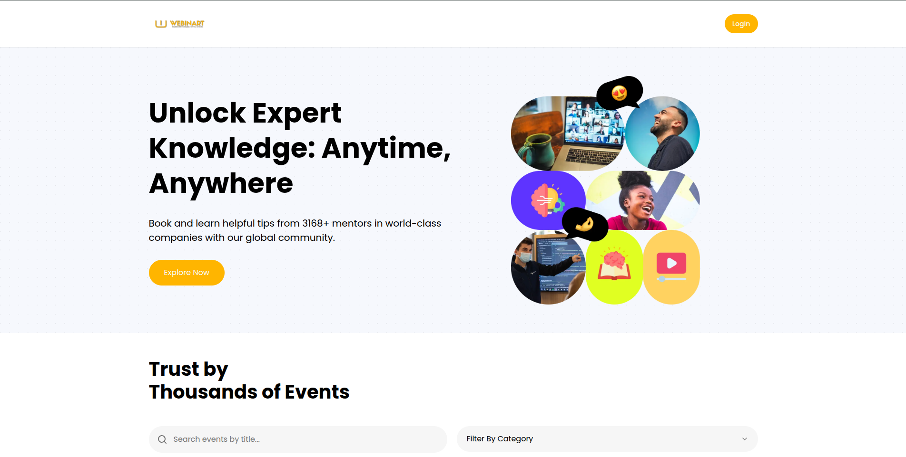

# WebInArt 🎯

**Unlock Expert Knowledge: Anytime, Anywhere**

WebInArt is a comprehensive event management platform that connects learners with world-class webinars and educational events. Discover, book, and attend expert-led sessions from 3168+ mentors across various domains including technology, marketing, AI, and more.



## 🌟 Features

### For Attendees

- **🔍 Smart Search & Discovery**: Find events by title, category, or keywords
- **📅 Event Browsing**: Browse upcoming webinars with detailed information
- **🎫 Secure Booking**: Purchase tickets with integrated Stripe payment processing
- **📱 Responsive Design**: Access from any device with a seamless experience
- **🔗 Direct Access**: Get event URLs and join links after booking

### For Event Organizers

- **✨ Event Creation**: Create and publish events with rich descriptions and media
- **🖼️ Media Upload**: Upload event banners and promotional images
- **💰 Pricing Control**: Set free or paid events with flexible pricing
- **📊 Order Management**: Track bookings and manage attendees
- **🏷️ Categorization**: Organize events by categories for better discoverability

### Core Functionality

- **🔐 User Authentication**: Secure login and registration with Clerk
- **🎨 Modern UI**: Beautiful, accessible interface built with Radix UI components
- **⚡ Real-time Updates**: Dynamic content updates and real-time data
- **🔄 Related Events**: Smart recommendations based on categories and interests

## 🚀 Live Demo

**🌐 [Visit WebInArt](https://webinart.vercel.app/)**

## 🛠️ Tech Stack

### Frontend

- **[Next.js 14](https://nextjs.org/)** - React framework with App Router
- **[TypeScript](https://www.typescriptlang.org/)** - Type-safe JavaScript
- **[Tailwind CSS](https://tailwindcss.com/)** - Utility-first CSS framework
- **[Radix UI](https://www.radix-ui.com/)** - Accessible component primitives
- **[Lucide React](https://lucide.dev/)** - Beautiful icons
- **[React Hook Form](https://react-hook-form.com/)** - Performant forms with validation
- **[ShadCN UI](https://ui.shadcn.com/)** - Beautiful, accessible UI components

### Backend & Database

- **[MongoDB](https://www.mongodb.com/)** - NoSQL database
- **[Mongoose](https://mongoosejs.com/)** - MongoDB object modeling
- **[Next.js API Routes](https://nextjs.org/docs/api-routes/introduction)** - Serverless API endpoints

### Authentication & Payments

- **[Clerk](https://clerk.com/)** - Complete authentication solution
- **[Stripe](https://stripe.com/)** - Payment processing platform

### File Management & Validation

- **[UploadThing](https://uploadthing.com/)** - File upload service
- **[Zod](https://zod.dev/)** - TypeScript-first schema validation

### Development Tools

- **[ESLint](https://eslint.org/)** - Code linting
- **[PostCSS](https://postcss.org/)** - CSS processing
- **[PNPM](https://pnpm.io/)** - Fast, disk space efficient package manager

## 📦 Installation

1. **Clone the repository**

   ```bash
   git clone https://github.com/yourusername/web-in-art.git
   cd web-in-art
   ```

2. **Install dependencies**

   ```bash
   pnpm install
   ```

3. **Set up environment variables**
   Create a `.env.local` file in the root directory:

   ```env
   # Database
   MONGODB_URI=your_mongodb_connection_string

   # Authentication (Clerk)
   NEXT_PUBLIC_CLERK_PUBLISHABLE_KEY=your_clerk_publishable_key
   CLERK_SECRET_KEY=your_clerk_secret_key
   NEXT_PUBLIC_CLERK_SIGN_IN_URL=/sign-in
   NEXT_PUBLIC_CLERK_SIGN_UP_URL=/sign-up
   NEXT_PUBLIC_CLERK_AFTER_SIGN_IN_URL=/
   NEXT_PUBLIC_CLERK_AFTER_SIGN_UP_URL=/

   # Payments (Stripe)
   STRIPE_SECRET_KEY=your_stripe_secret_key
   NEXT_PUBLIC_STRIPE_PUBLISHABLE_KEY=your_stripe_publishable_key
   STRIPE_WEBHOOK_SECRET=your_stripe_webhook_secret

   # File Upload (UploadThing)
   UPLOADTHING_SECRET=your_uploadthing_secret
   UPLOADTHING_APP_ID=your_uploadthing_app_id

   # App URL
   NEXT_PUBLIC_SERVER_URL=http://localhost:3000
   ```

4. **Run the development server**

   ```bash
   pnpm dev
   ```

5. **Open your browser**
   Navigate to [http://localhost:3000](http://localhost:3000)

## 🏗️ Project Structure

```
web-in-art/
├── app/                    # Next.js App Router
│   ├── (auth)/            # Authentication pages
│   ├── (root)/            # Main application pages
│   ├── api/               # API routes
│   └── globals.css        # Global styles
├── components/            # Reusable UI components
│   ├── shared/           # Shared components
│   └── ui/               # Base UI components
├── lib/                  # Utility functions and configurations
│   ├── actions/          # Server actions
│   ├── database/         # Database models and connection
│   └── utils.ts          # Helper functions
├── types/                # TypeScript type definitions
├── constants/            # Application constants
└── public/              # Static assets
```

## 🎨 Key Components

- **Event Management**: Create, update, and delete events
- **Search & Filter**: Advanced search with category filtering
- **Payment Integration**: Secure checkout with Stripe
- **User Profiles**: Manage personal information and event history
- **Responsive Design**: Mobile-first approach with Tailwind CSS

## 🤝 Contributing

1. Fork the repository
2. Create your feature branch (`git checkout -b feature/amazing-feature`)
3. Commit your changes (`git commit -m 'Add some amazing feature'`)
4. Push to the branch (`git push origin feature/amazing-feature`)
5. Open a Pull Request

## 📄 License

This project is licensed under the MIT License - see the [LICENSE](LICENSE) file for details.

## 🙏 Acknowledgments

- Built with [Next.js](https://nextjs.org/) and [React](https://reactjs.org/)
- UI components from [Radix UI](https://www.radix-ui.com/)
- Icons by [Lucide](https://lucide.dev/)
- Deployed on [Vercel](https://vercel.com/)

---

**Made with ❤️ for the learning community**
